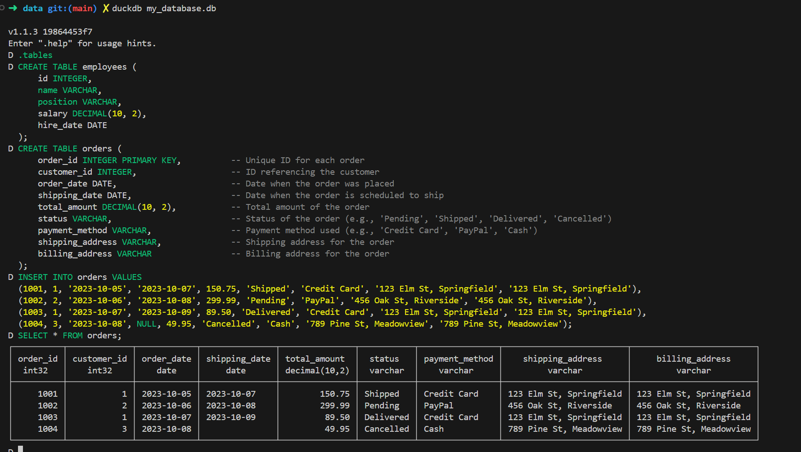
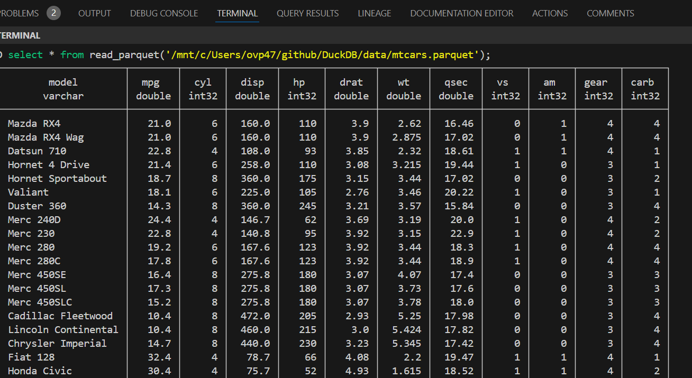
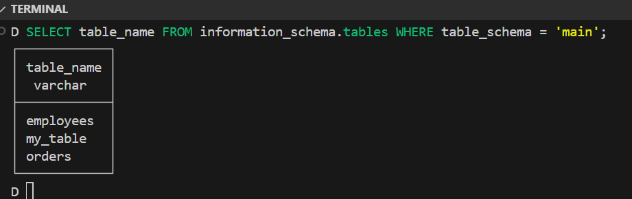

# DuckDB

## Introduction 
This is simply an overview of the capabilities the DuckDB.

DuckDB is an open-source, in-process SQL database management system optimized for fast analytics and data processing. It is often described as an "SQLite for analytics" because of its lightweight, embeddable nature and its focus on handling analytical queries efficiently. DuckDB is designed to work well with columnar data, which makes it particularly suited for data science, machine learning, and other use cases involving large-scale data analysis.

The key features of DuckDB:

1. Analytical Focus
DuckDB is optimized for complex analytical queries (OLAP workloads) rather than transactional workloads (OLTP). It uses a columnar storage format, which makes it fast for scanning large datasets and performing operations like aggregations, joins, and filtering.
2. In-Process Database
DuckDB operates in-process, meaning it can run inside another application without requiring a separate database server. This allows it to be embedded directly within applications, data science environments, and ETL pipelines, similar to SQLite.
3. Easy Integration with Data Science Ecosystem
DuckDB integrates well with tools commonly used in data science, such as Python, R, and Apache Arrow. It can read data from various sources, including Parquet files, CSV files, and other data formats, without needing a data loading step.
4. SQL Support
DuckDB supports a rich subset of SQL, including complex analytical functions, window functions, and aggregations, making it versatile for many data processing tasks.
5. Performance
DuckDB is designed to be fast, leveraging vectorized query execution, which processes data in chunks to take advantage of modern CPUs. It can perform well with both in-memory and disk-based queries and can scale effectively for larger datasets.
6. Concurrency and ACID Compliance
Although primarily focused on analytics, DuckDB supports ACID transactions, and it can handle concurrent read operations, making it reliable and suitable for multi-user environments.
7. Deployment and Usage
DuckDB can be used on personal computers, servers, and in cloud environments. It is often used directly from within programming languages (e.g., using a Python or R API) or command-line interfaces.
Typical Use Cases
Exploratory Data Analysis: DuckDB is ideal for data scientists who need a quick way to query and explore datasets.
ETL Pipelines: Its ability to read data in various formats makes it useful in data transformation pipelines.
Data Lake Querying: With support for file formats like Parquet, DuckDB can act as a simple yet powerful query engine on data lakes.
Overall, DuckDB provides a compelling combination of SQL compatibility, speed, and ease of integration with the data science workflow, making it increasingly popular in analytics-driven fields.

## Installation DuckDB 

### On MAC

```
brew install duckdb
```

### On The Linux /  WSL Ubuntu Terminal on the Windows

1. Download the latest Linux version of the DuckDB CLI. Try this command (this URL is subject to change if DuckDB releases a newer version):

```
wget https://github.com/duckdb/duckdb/releases/download/v1.1.3/duckdb_cli-linux-amd64.zip
```

2. Unzip the Linux version you downloaded:

```
unzip duckdb_cli-linux-amd64.zip

```

3. Move the Executable to Your PATH and Make It Executable

```
sudo mv duckdb /usr/local/bin/
sudo chmod +x /usr/local/bin/duckdb

```

4. Verify Installation

Run the following command to verify that DuckDB is correctly installed:

```
duckdb

```
5.  Check for the DuckDB Prompt: If DuckDB is correctly installed, you should see a prompt that looks something like this:

```
v1.1.3 19864453f7
Enter ".help" for usage hints.
Connected to a transient in-memory database.
Use ".open FILENAME" to reopen on a persistent database.
D 
```

To return from .mode duckbox, use the command ```Ctrl + Z```.
To get a list of the available CLI arguments, run the command  ```duckdb -help```.

DuckDB cannot query files that live elsewhere on the internet, but that capability is available via the official httpfs extension. If it is not already in your distribution, you can install and load the httpfs extension. This extension lets us directly query files hosted on an HTTP(S) server without having to download the files locally, it also supports S3 and some other cloud storage providers.

``` 
INSTALL httpfs;
LOAD httpfs;
```


##  Analyzing a CSV file with the DuckDB CLI

It doesn’t matter where our data is stored, be it on a remote HTTP server or cloud storage (S3, GCP, HDFS), DuckDB can process it now directly without having to do a manual download and import process. If, as is the case here, our URL or file name ends in a specific extension (e.g. .csv), DuckDB will automatically process it.
To Run the command in the duckbox.
```
SELECT count(*)
FROM 'https://github.com/bnokoro/Data-Science/raw/master/countries%20of%20the%20world.csv';

```


##  Create a Database File

1. To create a database in DuckDB , specify the database filename when launching DuckDB, or use the ```ATTACH DATABASE``` command. 
DuckDB will automatically create a new database if the file doesn’t exist.

In your terminal, create and open a new, empty DuckDB database by specifying a filename when launching DuckDB.
This command will create an empty database file named my_database.db in the current directory if it doesn’t already exist. If it already exists, DuckDB will open it without overwriting the data.
```
duckdb my_database.db
```
2. Verify the Empty Database

```
.tables
```

3. Exit DuckDB 
If you just wanted to create an empty database without adding tables or data right now, you can exit DuckDB by typing:
```
.exit
```

##  Add tables to the database

1. Open the Database ```duckdb my_database.db```
2. Create a Table

```
CREATE TABLE orders (
      order_id INTEGER PRIMARY KEY,          -- Unique ID for each order
      customer_id INTEGER,                   -- ID referencing the customer
      order_date DATE,                       -- Date when the order was placed
      shipping_date DATE,                    -- Date when the order is scheduled to ship
      total_amount DECIMAL(10, 2),           -- Total amount of the order
      status VARCHAR,                        -- Status of the order (e.g., 'Pending', 'Shipped', 'Delivered', 'Cancelled')
      payment_method VARCHAR,                -- Payment method used (e.g., 'Credit Card', 'PayPal', 'Cash')
      shipping_address VARCHAR,              -- Shipping address for the order
      billing_address VARCHAR                -- Billing address for the order
  );

```
3. Insert Sample Data into the `orders` Table

```
INSERT INTO orders VALUES
(1001, 1, '2023-10-05', '2023-10-07', 150.75, 'Shipped', 'Credit Card', '123 Elm St, Springfield', '123 Elm St, Springfield'),
(1002, 2, '2023-10-06', '2023-10-08', 299.99, 'Pending', 'PayPal', '456 Oak St, Riverside', '456 Oak St, Riverside'),
(1003, 1, '2023-10-07', '2023-10-09', 89.50, 'Delivered', 'Credit Card', '123 Elm St, Springfield', '123 Elm St, Springfield'),
(1004, 3, '2023-10-08', NULL, 49.95, 'Cancelled', 'Cash', '789 Pine St, Meadowview', '789 Pine St, Meadowview');

```
4. Query the `orders` Table to Verify

```
SELECT * FROM orders;
```



## Reading a Parquet File in DuckDB

DuckDB can read and write Parquet files directly, allowing you to use Parquet files as a data source or to export DuckDB tables into Parquet format.
To read a Parquet file in DuckDB, you can use the `read_parquet` function to treat it as a virtual table or load it into a DuckDB table for further processing.
1. Reading Parquet Data as a Virtual Table

If you want to query the Parquet file directly without importing it into a DuckDB table, you can do the following:

```
SELECT * FROM read_parquet('path/to/your_file.parquet');

```


2. Creating a Table from Parquet Data

If you want to load the data from a Parquet file into a DuckDB table:
```
CREATE TABLE my_table AS SELECT * FROM read_parquet('path/to/mtcars.parquet');
SELECT * FROM my_table;
```
This will create a new table my_table in DuckDB and load the data from the Parquet file into it.

To check how many tables exist in your DuckDB database, you can query the `information_schema.tables` system table, which stores metadata about tables.

```
SELECT table_name FROM information_schema.tables WHERE table_schema = 'main';

```


3. Writing Data to a Parquet File

You can also export data from a DuckDB table to a Parquet file. For example, if you want to save the `orders` table as a Parquet file:
```
COPY orders TO 'path/data/orders.parquet' (FORMAT PARQUET);

```

